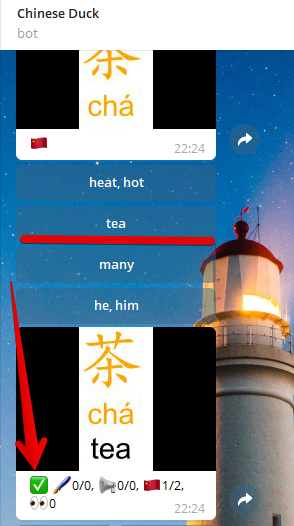

# Chinese Duck Bot

Telegram bot @ChineseDuckBot to study Chinese language via memorizing flashcards.

## Key features

- Generating flashcards based on users' vocabulary
- Tone highlighting with colors
- Auto-split word and phrases to syllables
- Web-part to view user's words
- Folders to group user's words
- Several modes how to learn the words - by viewing or by multipal-chioce tests
- Collection personal score
- Bulk import words from .csv file
- Webpart can work even if telegram addresses (https://t.me & so on) are blocked in your country.
- Pre-installed cards for HSK1, HSK2,... to bulk import to a separate folder.
  Now available HSK1-6 pre-installed folders: english & russain versions

## Commands

- /About - 🈴About this bot
- /Add - ➕Add a new chinese word
- /Default - 👌Set default mode
- /Delete - 🗑Remove a word from the dictionary
- /Edit - 🖌Edit an existing chinese word
- /Folder - 🗀Manage your current folder
- /Import - 🚛Import words from a file
- /Help - ❓List of available commands
- /LearnPronunciation - 📢Learn how to pronounce these words
- /LearnTranslation - 🇨🇳Learn what these words mean
- /LearnView - 🎓👀Just view these words
- /LearnWriting - 🖌Learn how to write these words
- /Mode - ⚙️Choose learn words mode
- /PreInstall - 🗀🕮Get pre-installed folders
- /Start - 🖐Welcome
- /View - 👀View a flash card
- /Web - 🌐Manage the web-part of the bot

## Roadmap

- Using webpart to manipulating the words
- Wiki-part
- Change domain
- More languages in csv templates
- Fix bugs & implement features
- Improve deploy & changelog

## API

You can find the description of Chinese Duck Bot Api on [our Swagger page](https://app.swaggerhub.com/apis/northis/chineseDuckApi/1.3).

## Build & Deploy

[See dev readme](README_DEV.md)
